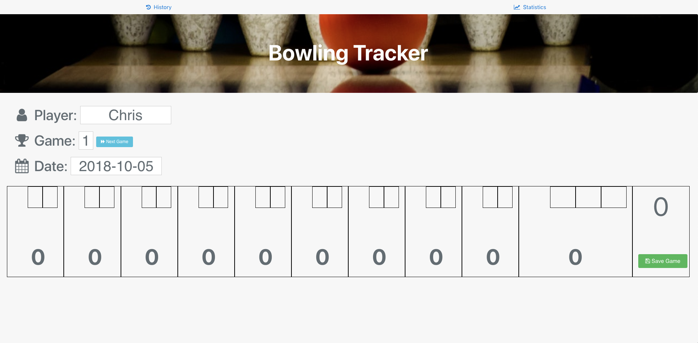
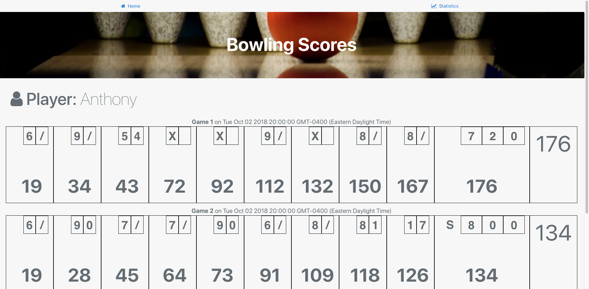
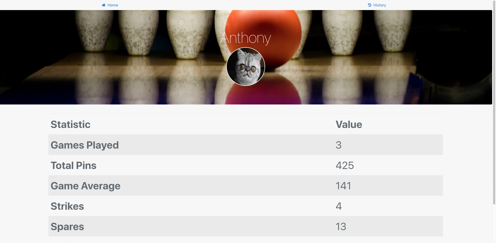

# Bowling
## Background
This is a pretty basic webapp built to track bowling scores. Data is inserted into a MongoDB Atlas database using a POST to Stitch's http service which inserts the record based on data provided. A Stitch trigger runs whenever new games are recorded to auto-calculate player stats.

This is a proof of concept as there Stitch features like OAuth login is not set to allow true multi-tenancy.

Bowling data is stored in `bowling.games` and player data is stored in `bowling.players` which doesn't really need to be backed up as that collection's data is calculated by the trigger mentioned above.

Bowling score calculations appear to be correct based on my test data. However that was harder to program than I expected.

## Screenshots
### Data Entry

### History

### Data Basic Stats
